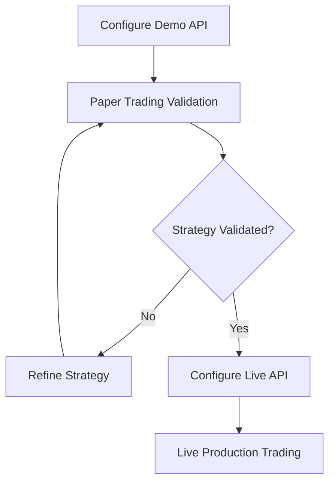

# Trading Basics

This section focuses on practical trading workflows and platform operation, rather than trading strategy theory.

## Safe Initialization Workflow

1. Configure and verify your Demo API credentials.
2. Add your target trading pair to the Market Watch panel.
3. Open a chart and select your analysis timeframe.
4. Add desired technical indicators.
5. Validate strategy behavior in paper trading before deploying to live production.

### Migration Path: Paper to Live Trading

## Core Platform Concepts

- **Trading View Tabs:** Manage chart workspaces, indicators, and active timeframes.
- **Market Watch:** Manages watch lists and facilitates rapid instrument context switches.
- **Backtesting & Simulation:** Built-in engines to simulate and backtest historical trading logic.

## Operational Recommendations

- Start with a small number of symbols to minimize cognitive load.
- Maintain a primary analysis timeframe and a secondary confirmation timeframe.
- Save settings immediately after modifying API keys or proxy configurations.
- Verify notification channels (e.g., Telegram notifier) before relying on automated alert triggers.

## Risk Disclaimer

Trading financial instruments involves high risk and may result in the loss of all capital. This software does not guarantee profitability.

## Related Docs

- [Market Watch](./market-watch.md)
- [Drawing Tools](./drawing-tools.md)
- [FAQ](./faq.md)
