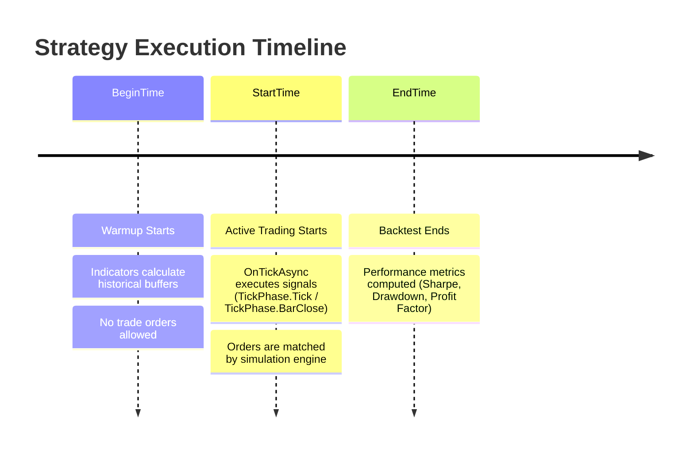

# Backtesting & Performance Optimization

Backtesting is the foundation of systematic trading. It allows you to test hypotheses, calibrate risk parameters, and evaluate historical drawdowns before risking real capital. The Platinum Trade platform provides an event-driven backtesting engine capable of simulating orders against historical market data.

This guide explains the backtesting lifecycle, data options, and techniques to optimize strategy performance for rapid testing.

---

## The Backtesting Lifecycle

The backtest execution timeline is structured into two distinct phases: **Warmup Phase** and **Active Simulation Phase**.



### 1. Warmup Phase (`BeginTime` $\rightarrow$ `StartTime`)
- Before trading begins, the engine loads enough historical candles prior to `StartTime` to seed technical indicators (e.g., 200 bars for a 200-period EMA).
- During warmup, indicators calculate their internal buffers, but **no trade orders are placed**.
- You can inspect [`Context.Timeseries.BeginTime`](../api-reference/client/timeseries-and-indicators/timeseries.md#begintime) and [`Context.Timeseries.StartTime`](../api-reference/client/timeseries-and-indicators/timeseries.md#starttime).

### 2. Active Simulation Phase (`StartTime` $\rightarrow$ `EndTime`)
- The engine simulates price flow according to your selected data resolution (`PriceDataOption`).
- Every order placed via `Context.Trade` is routed to the local simulator, tracking fills, slippage, and fees.
- [`Context.Timeseries.GetCurrentTime()`](../api-reference/client/timeseries-and-indicators/timeseries.md#getcurrenttime) returns the simulated historical timestamp, **not** your local machine clock.

---

## Price Data Options

When configuring a backtest in Platinum Trade, you can choose among several simulation models:

| Mode | Precision | Speed | When to Use |
| :--- | :--- | :--- | :--- |
| **Bar Close Only** (`OpenCloseHighLow`) | Standard | ⚡⚡⚡ Maximum | Best for strategies executing on closed candles (`tickPhase == TickPhase.BarClose`), parameter sweeps, and genetic optimization. |
| **1-Minute Interpolation** (`OneMinute`) | High | ⚡⚡ Fast | Simulates intra-bar price movement using historical 1-minute bars. Ideal for trailing stops and stop-loss verification. |
| **Tick by Tick** (`Tick`) | Ultra | ⚡ Accurate | Uses actual historical tick records. Essential for scalp bots, high-frequency strategies, and order book simulations. |

---

## Deterministic Code: Backtest vs. Live Mode

To ensure your strategy behaves identically in backtest and live trading:

### 1. Always Use `GetCurrentTime()` Instead of `DateTime.UtcNow`
In backtests, `DateTime.UtcNow` returns your computer's real-time clock, which breaks historical session filters (e.g., London Open, Asia Session).

```csharp
// ❌ WRONG: Uses local computer clock in backtest
DateTime now = DateTime.UtcNow;

// ✅ CORRECT: Returns historical simulated time in backtest, and UTC in live trading
DateTime now = Context.Timeseries.GetCurrentTime();
if (now.Hour == 8 && now.Minute == 0)
{
    // Executes cleanly at 08:00 UTC regardless of backtest or live mode
}
```

### 2. Detect Backtest vs. Live Environment
You can determine if the strategy is running in a backtest by inspecting `Context.Timeseries.EndTime`:

```csharp
bool isBacktest = Context.Timeseries.EndTime.HasValue;
if (!isBacktest)
{
    // Send Telegram alert only in live trading
    await Context.Notify.SendTelegramMessageAsync("Live trade executed!");
}
```

---

## Performance Optimization Techniques

High-speed backtesting allows you to test thousands of parameter combinations in seconds. Follow these best practices to eliminate performance bottlenecks:

### 1. Use Vectorized Copy APIs for Multi-Bar Math
Instead of querying candles one by one in a `for` loop, use the component copy APIs (`CopyCloses`, `CopyHighs`, etc.):

```csharp
// ❌ SLOW: Multiple async calls per candle
decimal sum = 0;
for (int i = 1; i <= 50; i++)
{
    var candle = await Context.Timeseries.GetOHLCVAsync(shift: i);
    sum += candle.Close;
}

// ✅ FAST: Single vectorized batch copy directly into a contiguous primitive array
decimal[] closes = await Context.Timeseries.CopyCloses(startPos: 1, count: 50);
decimal sum = closes.Sum();
```

### 2. Understand Indicator Evaluation (Lazy vs. Eager)
By default, the SDK calculates indicators **once at the open of each new bar**. 

- If your strategy trades on closed bars (`tickPhase == TickPhase.BarClose`), indicator buffers are already updated. **Do not** call `UpdateOpenCandleIndicators()`.
- Only call [`Context.Timeseries.UpdateOpenCandleIndicators()`](../api-reference/client/timeseries-and-indicators/timeseries.md#updateopencandleindicators) inside `OnTickAsync` during intra-bar ticks (`tickPhase == TickPhase.Tick`) if your strategy logic explicitly requires indicator values based on unclosed, forming candle ticks.

```csharp
public override async Task OnTickAsync(TickPhase tickPhase, CancellationToken ct)
{
    if (tickPhase == TickPhase.Tick)
    {
        // Call only if you need forming candle values on intermediate ticks
        Context.Timeseries.UpdateOpenCandleIndicators();
        double intraBarRsi = _rsi.GetValue(0); // Value reflecting current forming candle tick
    }
}
```

### 3. Avoid Heap Allocations in `OnTickAsync`
`OnTickAsync` can be invoked millions of times during a backtest. Avoid allocating strings, LINQ expressions, or temporary objects on every tick:

```csharp
// ❌ SLOW: Allocates strings and objects on every single tick
Context.Logger.LogInformation("Tick", $"Price={Context.Timeseries.CurrentTickPrice} at {DateTime.Now}");

// ✅ FAST: Execute heavy logic and logging only on bar closes or state changes
if (tickPhase == TickPhase.BarClose && signalTriggered)
{
    Context.Logger.LogInformation("Signal", $"Trade signal triggered at price: {Context.Timeseries.CurrentTickPrice}");
}
```

---

## Summary Checklist

| Topic | Recommendation |
| :--- | :--- |
| **Clock Source** | Use `Context.Timeseries.GetCurrentTime()` for all time comparisons. |
| **Warmup Margin** | Provide at least 200+ warmup bars to avoid `NaN` indicator values. |
| **Look-Ahead Bias** | Reference `GetValue(1)` on closed bars to guarantee real-world reproducibility. |
| **Vectorization** | Use `CopyCloses`, `CopyHighs`, `CopyLows` for batch mathematical operations. |
| **Backtest Detection** | Check `Context.Timeseries.EndTime.HasValue` to skip sending live alerts during simulations. |

---

## Related Documentation

- [Debugging Guide](./debugging.md) — Debugging backtests with breakpoints and Visual Studio.
- [Multi-Timeframe Guide](./multi-timeframe.md) — Handling multiple timeframes in backtests without look-ahead bias.
- [Timeseries API Reference](../api-reference/client/timeseries-and-indicators/timeseries.md) — Details on `CopySeries` and `UpdateOpenCandleIndicators`.
- [State Management Guide](./state-persistence.md) — Managing strategy state between backtest runs and live restarts.
