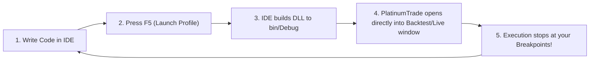

# Debugging Strategies & Indicators

This guide explains how to debug your custom PlatinumTrade **Strategy** and **Indicator** plugins with live breakpoints using **Visual Studio**, **JetBrains Rider**, or **VS Code**.

---

## Execution Model Differences

Before getting started, note the architectural difference between the two plugin types:

| Plugin Type | Execution Model | Recommended Debugging Method |
| :--- | :--- | :--- |
| **Strategy Plugin** (`IStrategy`) | Runs in a dedicated child process (`--strategy-host`). | Use `launchSettings.json` with the `--strategy-host` profile to **press F5 and launch directly into the Backtest/Live window**. |
| **Indicator Plugin** (`IIndicatorPlugin`) | Executes in the main GUI process (chart calculation) or is invoked from within a Strategy. | **Method 1**: Launch the main app (F5/Attach) and load the DLL onto a Chart.<br/>**Method 2**: Embed the indicator into a Strategy and debug via the Strategy Backtest F5 loop. |

---

# PART 1: Debugging Strategies (Strategy Plugin)

## 1. The Inner Dev-Loop

PlatinumTrade allows you to skip opening the main dashboard and re-selecting DLL files every time you modify your code. You can configure your IDE to launch directly into the strategy execution window:



### Step 1: Initial Setup in PlatinumTrade App (One-Time)

1. Launch **PlatinumTrade.exe**.
2. Open the **Strategy Configuration** tab.
3. Click **Browse** and select your project's compiled DLL:
   ```
   <YourProjectDirectory>/bin/Debug/net10.0/<YourStrategy>.dll
   ```
4. Configure your desired **Symbol** (e.g., `BTC-USDT`), **Timeframe** (e.g., `1m`), **Date Range**, and **Input Parameters**.
5. Click **Start Backtest** (or **Start Live**) once.

> [!TIP]
> This run persists your DLL path, symbol settings, and parameter values to local storage on disk. Subsequent direct F5 launches from your IDE will read and reuse these saved settings automatically.

---

### Step 2: Configure `launchSettings.json` in Your Strategy Project

In your strategy project, configure `Properties/launchSettings.json`:

```json
{
  "profiles": {
    "Backtest": {
      "commandName": "Executable",
      "executablePath": "%LocalAppData%\\PlatinumTrade\\current\\PlatinumTrade.exe",
      "commandLineArgs": "--strategy-host --mode=backtest",
      "workingDirectory": "$(TargetDir)"
    },
    "Live": {
      "commandName": "Executable",
      "executablePath": "%LocalAppData%\\PlatinumTrade\\current\\PlatinumTrade.exe",
      "commandLineArgs": "--strategy-host --mode=live",
      "workingDirectory": "$(TargetDir)"
    }
  }
}
```

> [!NOTE]
> PlatinumTrade installed via Velopack defaults to `%LocalAppData%\PlatinumTrade\current\PlatinumTrade.exe` (or your local `bin\Debug\...` folder if running from source).

---

### Step 3: Set Breakpoints & Press F5

1. Open your strategy source file (e.g., `MyStrategy.cs`).
2. Place a breakpoint (press **F9**) inside `OnInitAsync` or `RunAsync`.
3. In Visual Studio / Rider, select the **Backtest** launch profile from the run dropdown.
4. Press **F5** (Start Debugging).

```csharp
public async Task RunAsync(
    StrategyEventType eventType,
    IStrategyStateStore state,
    CancellationToken ct)
{
    // Place breakpoint here:
    if (eventType == StrategyEventType.Kline)
    {
        var candle = await _client.Timeseries.GetCurrentCandleAsync(ct: ct);
        
        // Inspect variables in Visual Studio Autos / Watch window
        _logger.LogInformation("Signal", "Checking signal at candle close: {Close}", candle.Close);
    }
}
```

---

## 2. Adjusting Strategy Parameters During Debugging

- **Method 1 (Edit in C# code - Fastest)**: Change the `DefaultValue` attribute on your `IStrategyInput` property:
  ```csharp
  [InputParameter(Name = "Fast EMA", DefaultValue = 14)]
  public int FastPeriod { get; set; } = 14;
  ```
  When you press **F5**, the host automatically picks up the new default from the freshly compiled DLL.
- **Method 2 (Edit in GUI)**: Open the main app, adjust the parameters in the Strategy Configuration panel, and run once to save the new parameter set.

---

# PART 2: Debugging Indicators (Indicator Plugin)

Indicators do not run via `--strategy-host` standalone flags. Instead, they run directly on chart windows or inside strategy loops.

## Method 1: Debugging Directly on Charts (Recommended)

### 1. Configure Launch Profile in Indicator Project

Create `Properties/launchSettings.json` in your indicator project to launch the main PlatinumTrade application:

```json
{
  "profiles": {
    "PlatinumTrade App": {
      "commandName": "Executable",
      "executablePath": "%LocalAppData%\\PlatinumTrade\\current\\PlatinumTrade.exe",
      "workingDirectory": "$(TargetDir)"
    }
  }
}
```

### 2. Debugging Workflow

1. Place a breakpoint inside `Calculate(int index)` or the constructor of your indicator class (inheriting from `CalcIndBase`).
2. Press **F5** in Visual Studio to start the main PlatinumTrade application under the debugger.
3. On the chart, navigate to **Indicators > Plugins > Load Plugin DLL** and select your compiled DLL from `bin/Debug/`.
4. Add the indicator to a chart.
5. As the chart renders and calculates bars, Visual Studio will **stop directly at your breakpoint** in `Calculate`.

> [!TIP]
> You can also launch PlatinumTrade normally, then in Visual Studio choose **Debug > Attach to Process...** (`Ctrl + Alt + P`) -> select `PlatinumTrade.exe` and attach.

---

## Method 2: Debugging via a Strategy Harness

If your indicator is used within a custom strategy, you can debug it through the Strategy Backtest F5 loop:

1. Request or load your custom indicator within a Strategy:
   ```csharp
   // Inside OnInitAsync or strategy constructor
   var customIndicator = await _client.Timeseries.GetCustomIndicatorAsync<MyCustomIndicator>("MyIndicatorName");
   ```
2. Place breakpoints in your indicator source file.
3. Run the Strategy **Backtest** profile (F5). As historical candles stream through the backtest engine, the indicator's calculation pipeline executes, triggering your breakpoints.

---

# Advanced Debugging Techniques

### 1. Programmatic JIT Debugger Launch (`Debugger.Launch`)

Add the following to `OnInitAsync` of a strategy or the constructor of an indicator:

```csharp
#if DEBUG
if (!System.Diagnostics.Debugger.IsAttached)
{
    System.Diagnostics.Debugger.Launch();
}
#endif
```

When execution reaches this line, Windows opens the **Visual Studio Just-In-Time Debugger** dialog, allowing you to select your IDE and attach instantly.

---

### 2. Strategy & Indicator Unit Testing (No GUI Required)

You can write isolated unit tests to verify indicator calculations and strategy math rapidly using standard test frameworks (NUnit, xUnit, MSTest):

```csharp
[Test]
public void Calculate_GivenValidCandles_CalculatesExpectedBuffer()
{
    var indicator = new MyCustomIndicator();
    // Initialize mock buffers and test calculation logic
    indicator.Calculate(0);
    Assert.That(indicator.Values[0], Is.GreaterThan(0));
}
```

---

## Troubleshooting

| Issue | Cause | Solution |
| :--- | :--- | :--- |
| **Breakpoint shows "The breakpoint will not currently be hit"** | Debug symbols (`.pdb`) not loaded or DLL loaded from wrong path. | Ensure project is set to `Debug` mode. Verify that `PlatinumTrade.exe` is loading the DLL from your current `bin/Debug/` directory. |
| **F5 does not stop at Indicator breakpoint** | Running `--strategy-host` profile which only hosts Strategies. | Use the main app launch profile (without `--strategy-host`) and attach the indicator to a Chart, or embed the indicator in a Strategy harness. |
| **Settings not loading on F5** | No prior run was performed from GUI. | Run once from the main GUI to persist settings to disk. |

---

## Related Documentation

- [Getting Started Guide](./getting-started.md)
- [Indicator Plugin Development](../plugins/indicator/overview.md)
- [Input Parameters Reference](../plugins/strategy/input-parameters.md)
- [Strategy Lifecycle Overview](../plugins/strategy/overview.md)
