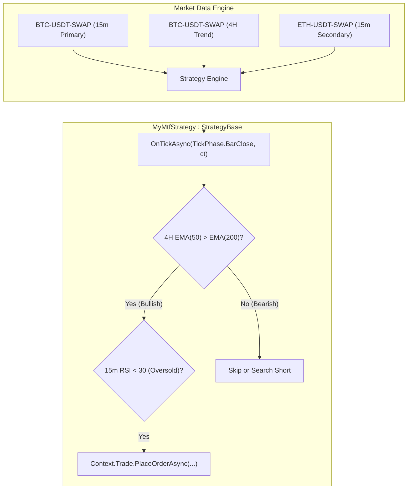

# Multi-Timeframe & Multi-Symbol Strategies

In quantitative and algorithmic trading, single-timeframe strategies often suffer from market noise or lack of broader context. **Multi-Timeframe (MTF)** analysis allows strategies to filter higher-level trends (e.g., Daily or 4-Hour charts) while pinpointing precision entries on lower timeframes (e.g., 5-Minute or 15-Minute charts). Furthermore, **Multi-Symbol** capabilities enable portfolio-level strategies, statistical arbitrage, and pairs trading.

This guide walks you through building multi-timeframe and multi-symbol strategies in the Platinum Trade SDK.

---

## Key Concepts



1. **Primary Pair vs Secondary Pairs**:
   - The strategy's primary symbol and timeframe are defined by the user in the strategy settings UI or launcher profile.
   - Secondary symbols and timeframes are declared dynamically when initializing indicators via `Context.Timeseries.CreateIndicator*`.
2. **Automatic Data Registration**:
   - Whenever you create an indicator with a specific `(symbol, timeframe)`, the SDK registers that pair in [`Context.Timeseries.SymbolsTimeframes`](../api-reference/client/timeseries-and-indicators/timeseries.md#symbolstimeframes).
   - Historical warmup data and live candle subscriptions are automatically allocated for all registered pairs.
3. **Preventing Look-Ahead Bias**:
   - When referencing higher timeframe (HTF) data from a lower timeframe (LTF) execution loop, always use **closed candles** (`shift: 1` or `GetValue(1)`) to avoid evaluating unclosed HTF candles whose values might change before the bar completes.

---

## 1. Initializing Multi-Timeframe Indicators

To create indicators for a different timeframe than the primary strategy timeframe, pass the explicit `symbol` and `timeframe` parameters to the indicator factory methods in `OnInitAsync()`.

```csharp
using Pt.Okx.Sdk.Clients.Market.Models;
using Pt.Okx.Sdk.Enums;
using Pt.Okx.Sdk.Indicators.BuiltIn;
using Pt.Okx.Sdk.Indicators.Enums;
using Pt.Okx.Sdk.Strategy;

public class TrendFilterMtfStrategy : StrategyBase
{
    // Higher Timeframe (4-Hour) Indicators for Trend Direction
    private IIndicatorMA _htfFastEma = null!;
    private IIndicatorMA _htfSlowEma = null!;

    // Primary Timeframe (15-Minute) Indicator for Entry Timing
    private IIndicatorRSI _ltfRsi = null!;

    public override Task<bool> OnInitAsync(IStrategyStateStore state, CancellationToken cancellationToken)
    {
        // 1. Initialize 4H Trend Filters (Explicit Timeframe.FourHours)
        _htfFastEma = Context.Timeseries.CreateIndicatorMA(
            symbol: null, // null defaults to the strategy's primary symbol
            timeframe: Timeframe.FourHours,
            period: 50,
            method: MaMethod.Ema,
            appliedPrice: AppliedPrice.Close,
            indicatorAlias: "4H_EMA50"
        );

        _htfSlowEma = Context.Timeseries.CreateIndicatorMA(
            symbol: null,
            timeframe: Timeframe.FourHours,
            period: 200,
            method: MaMethod.Ema,
            appliedPrice: AppliedPrice.Close,
            indicatorAlias: "4H_EMA200"
        );

        // 2. Initialize 15m Entry Indicator (null defaults to primary timeframe)
        _ltfRsi = Context.Timeseries.CreateIndicatorRSI(
            symbol: null,
            timeframe: null, // Defaults to primary timeframe (e.g., 15m)
            period: 14,
            indicatorAlias: "15M_RSI14"
        );

        Context.Logger.LogInformation("Init", "MTF Indicators registered successfully.");
        return Task.FromResult(true);
    }

    public override Task<bool> OnStopAsync(CancellationToken cancellationToken) => Task.FromResult(true);
}
```

> [!TIP]
> Giving each indicator a descriptive `indicatorAlias` helps distinguish log entries and chart buffers when inspecting execution details.

---

## 2. Trading Logic with Proper Bar Indexing

In `OnTickAsync(TickPhase tickPhase, CancellationToken ct)`, check `if (tickPhase != TickPhase.BarClose) return;` so your code executes on every primary bar close (e.g., every 15 minutes). You can query the 4H trend indicators directly using buffer index `1` (last closed 4H candle):

```csharp
public override async Task OnTickAsync(TickPhase tickPhase, CancellationToken ct)
{
    // Execute trade logic only when a primary bar closes
    if (tickPhase != TickPhase.BarClose) return;

    // 1. Read the last closed 4-Hour EMA values (Shift 1 = last closed 4H bar)
    double htfFast = _htfFastEma.GetValue(1);
    double htfSlow = _htfSlowEma.GetValue(1);

    if (double.IsNaN(htfFast) || double.IsNaN(htfSlow))
    {
        // Warmup data still loading
        return;
    }

    bool isBullishTrend = htfFast > htfSlow;
    bool isBearishTrend = htfFast < htfSlow;

    // 2. Read the last closed 15-Minute RSI value
    double ltfRsi = _ltfRsi.GetValue(1);

    // 3. Evaluate MTF Entry Conditions
    if (isBullishTrend && ltfRsi < 30)
    {
        Context.Logger.LogInformation("Signal", $"Bullish MTF Setup: 4H Trend is UP, 15m RSI={ltfRsi:F2} is oversold.");

        // Check if we already have an open position
        var posRes = await Context.Trade.GetPositionsAsync(ct: ct);
        if (posRes.Success && posRes.Data.Length == 0)
        {
            await Context.Trade.PlaceOrderAsync(
                symbol: "BTC-USDT-SWAP",
                side: OrderSide.Buy,
                type: OrderType.Market,
                quantity: 1.0m,
                ct: ct
            );
        }
    }
}
```

> [!IMPORTANT]
> **Look-Ahead Bias Prevention**:
> - Always use `_indicator.GetValue(1)` when reading higher timeframe indicators in lower timeframe loops.
> - Index `0` represents the *currently forming* higher timeframe candle, which fluctuates throughout the 4 hours and only finalizes when the 4H bar closes. Using `GetValue(0)` in backtests can produce unrealistic results that cannot be replicated in live trading.

---

## 3. Querying Multiple Symbols (Pairs Trading / Basket Trading)

The Platinum Trade SDK allows a single strategy to monitor and trade multiple symbols simultaneously.

```csharp
public class PairsTradingStrategy : StrategyBase
{
    private const string BtcSymbol = "BTC-USDT-SWAP";
    private const string EthSymbol = "ETH-USDT-SWAP";

    private IIndicatorMA _btcSma = null!;
    private IIndicatorMA _ethSma = null!;

    public override Task<bool> OnInitAsync(IStrategyStateStore state, CancellationToken cancellationToken)
    {
        // Subscribe to BTC-USDT-SWAP 1-Hour SMA
        _btcSma = Context.Timeseries.CreateIndicatorMA(
            symbol: BtcSymbol,
            timeframe: Timeframe.OneHour,
            period: 20
        );

        // Subscribe to ETH-USDT-SWAP 1-Hour SMA
        _ethSma = Context.Timeseries.CreateIndicatorMA(
            symbol: EthSymbol,
            timeframe: Timeframe.OneHour,
            period: 20
        );

        return Task.FromResult(true);
    }

    public override Task<bool> OnStopAsync(CancellationToken cancellationToken) => Task.FromResult(true);

    public override async Task OnTickAsync(TickPhase tickPhase, CancellationToken ct)
    {
        if (tickPhase != TickPhase.BarClose) return;

        // Fetch the latest closed candles for both instruments
        CandleData btcCandle = await Context.Timeseries.GetLastClosedCandleAsync(BtcSymbol, Timeframe.OneHour, ct);
        CandleData ethCandle = await Context.Timeseries.GetLastClosedCandleAsync(EthSymbol, Timeframe.OneHour, ct);

        decimal btcDev = (btcCandle.Close - (decimal)_btcSma.GetValue(1)) / (decimal)_btcSma.GetValue(1);
        decimal ethDev = (ethCandle.Close - (decimal)_ethSma.GetValue(1)) / (decimal)_ethSma.GetValue(1);

        decimal spread = btcDev - ethDev;

        Context.Logger.LogInformation("Spread", $"BTC/ETH Divergence: {spread:P2}");

        // Place orders across multiple symbols
        if (spread > 0.03m) // BTC outperforming ETH significantly -> Mean Reversion
        {
            await Context.Trade.PlaceOrderAsync(BtcSymbol, OrderSide.Sell, OrderType.Market, 0.1m, ct: ct);
            await Context.Trade.PlaceOrderAsync(EthSymbol, OrderSide.Buy, OrderType.Market, 1.5m, ct: ct);
        }
    }
}
```

---

## 4. Bulk Component Extraction across Timeframes

For statistical or machine learning indicators requiring multi-bar calculations, use the vectorized copy APIs (`CopyCloses`, `CopyHighs`, etc.) with explicit symbol and timeframe parameters:

```csharp
// Extract the last 50 close prices of ETH-USDT-SWAP on 1D timeframe
decimal[] dailyCloses = await Context.Timeseries.CopyCloses(
    symbol: "ETH-USDT-SWAP",
    timeframe: Timeframe.OneDay,
    startPos: 1,
    count: 50
);

decimal highestClose = dailyCloses.Max();
decimal lowestClose = dailyCloses.Min();
decimal averagePrice = dailyCloses.Average();
```

---

## Best Practices Checklist

| Practice | Recommendation |
| :--- | :--- |
| **Warmup Bars** | Ensure your strategy warmup period is large enough to satisfy the highest timeframe's longest indicator period (e.g., 200 bars on 4H = 800 hours = ~34 days of data). |
| **Look-Ahead Bias** | Use `GetValue(1)` or `startPos: 1` for all higher timeframe indicator and candle queries. |
| **Position Checks** | Always check `Context.Trade.GetPositionsAsync()` before opening new trades to avoid accidental over-leveraging across multiple symbols. |
| **Symbol Suffixes** | Use the standard OKX swap instrument format (e.g., `"BTC-USDT-SWAP"`). |

---

## Related Documentation

- [Market Data & Timeseries Guide](./market-data.md) — Fundamental OHLCV and indicator handling.
- [Timeseries Client API Reference](../api-reference/client/timeseries-and-indicators/timeseries.md) — Full method signatures for `CopySeries`, `CopyCloses`, and factory methods.
- [Trade Client API Reference](../api-reference/client/trade.md) — Placing and managing orders across multiple symbols.
- [Debugging Guide](./debugging.md) — Setting up inner-loop debugging for multi-timeframe strategies.
