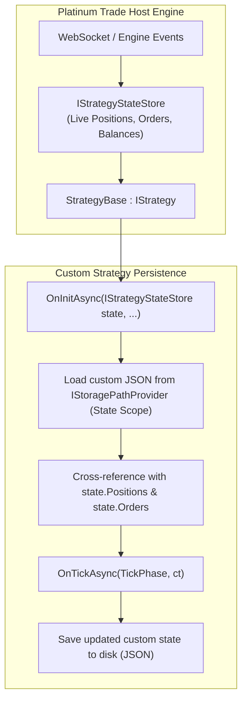

# State Management & Crash Recovery

In automated algorithmic trading, strategies must handle live market state tracking, bot restarts, and crash recovery seamlessly. 

The Platinum Trade SDK separates state management into two distinct architectural components:
1. **Live Runtime State (`IStrategyStateStore`)**: An in-memory container maintained by the host engine tracking active orders, positions, balances, and last received market data.
2. **Persistent Disk Storage (`IStoragePathProvider`)**: A sandbox-isolated directory resolver used to save and load custom strategy state (e.g., custom grid levels, cumulative risk stats, trailing watermarks) to survive application restarts.

---

## Architecture Overview



---

## 1. Inspecting Live Runtime State (`IStrategyStateStore`)

When your strategy starts, the host engine injects an instance of `IStrategyStateStore` into `OnInitAsync()`. You can hold a reference to this store to inspect live trading conditions without making repeated asynchronous network calls:

```csharp
public interface IStrategyStateStore
{
    IReadOnlyList<Order> Orders { get; }
    IReadOnlyList<AlgoOrder> AlgoOrders { get; }
    IReadOnlyList<Position> Positions { get; }
    IReadOnlyList<AccountBalance> Balances { get; }
    IReadOnlyList<Transaction> Transactions { get; }
    
    CandleData? LastKline { get; }
    bool HasOpenPosition { get; }
    bool HasOpenOrders { get; }
    bool HasProtectiveAlgoOrders { get; }
    int OpenOrderCount { get; }
    int AlgoOrderCount { get; }
}
```

### Example: Quick Position & Order Checks
```csharp
public override async Task OnTickAsync(TickPhase tickPhase, CancellationToken ct)
{
    if (tickPhase != TickPhase.BarClose) return;

    // Fast in-memory state inspection
    if (_stateStore.HasOpenPosition)
    {
        var primaryPos = _stateStore.Positions.FirstOrDefault(p => p.Symbol == "BTC-USDT-SWAP");
        if (primaryPos != null)
        {
            Context.Logger.LogInformation("State", $"Current Position Qty: {primaryPos.PositionQuantity}, PnL: {primaryPos.UnrealizedPnl}");
        }
        return;
    }

    if (!_stateStore.HasOpenOrders)
    {
        // Safe to place a new entry order
    }
}
```

---

## 2. Persisting Custom Strategy Data with `IStoragePathProvider`

For custom variables that must survive process shutdowns (like grid layer counts, high-water marks, or daily loss limits), use `IStoragePathProvider` to resolve the dedicated `StoragePathScope.State` directory:

```csharp
using System.Text.Json;
using Pt.Okx.Sdk.Enums;
using Pt.Okx.Sdk.Storage;
using Pt.Okx.Sdk.Storage.Enums;
using Pt.Okx.Sdk.Strategy;
using Pt.Okx.Sdk.Strategy.Events;

public class CustomBotState
{
    public DateTime LastSavedUtc { get; set; }
    public decimal HighWaterMarkPrice { get; set; }
    public int CompletedCycleCount { get; set; }
    public decimal CumulativeSessionPnl { get; set; }
}

public class ResilientStrategy : StrategyBase
{
    private IStrategyStateStore _stateStore = null!;
    private readonly IStoragePathProvider _storage;
    private CustomBotState _customState = new();
    private string _stateFilePath = string.Empty;

    // Injected via DI container
    public ResilientStrategy(IStoragePathProvider storage)
    {
        _storage = storage;
    }

    public override async Task<bool> OnInitAsync(IStrategyStateStore state, CancellationToken cancellationToken)
    {
        _stateStore = state;

        // 1. Resolve safe state directory on disk
        string stateDir = _storage.GetPath(StoragePathScope.State);
        _stateFilePath = Path.Combine(stateDir, "my_strategy_state.json");

        // 2. Load previous state if it exists
        if (File.Exists(_stateFilePath))
        {
            try
            {
                string json = await File.ReadAllTextAsync(_stateFilePath, cancellationToken);
                _customState = JsonSerializer.Deserialize<CustomBotState>(json) ?? new();
                Context.Logger.LogInformation("Recovery", $"State loaded. HighWaterMark={_customState.HighWaterMarkPrice}");
            }
            catch (Exception ex)
            {
                Context.Logger.LogError(ex, "Failed to deserialize state file, starting fresh.");
                _customState = new CustomBotState();
            }
        }
        else
        {
            _customState = new CustomBotState
            {
                HighWaterMarkPrice = Context.Timeseries.CurrentTickPrice,
                LastSavedUtc = Context.Timeseries.GetCurrentTime()
            };
            await SaveCustomStateAsync(cancellationToken);
        }

        // 3. Reconcile with live host engine state
        if (_stateStore.HasOpenPosition)
        {
            Context.Logger.LogInformation("Reconcile", $"Strategy resumed with {_stateStore.Positions.Count} open position(s).");
        }

        return true;
    }

    public override Task<bool> OnStopAsync(CancellationToken cancellationToken) => Task.FromResult(true);

    public override async Task OnTickAsync(TickPhase tickPhase, CancellationToken ct)
    {
        if (tickPhase != TickPhase.BarClose) return;

        decimal currentPrice = Context.Timeseries.CurrentTickPrice;
        if (currentPrice > _customState.HighWaterMarkPrice)
        {
            _customState.HighWaterMarkPrice = currentPrice;
            _customState.LastSavedUtc = Context.Timeseries.GetCurrentTime();
            await SaveCustomStateAsync(ct);
        }
    }

    private async Task SaveCustomStateAsync(CancellationToken ct)
    {
        string json = JsonSerializer.Serialize(_customState, new JsonSerializerOptions { WriteIndented = true });
        await File.WriteAllTextAsync(_stateFilePath, json, ct);
    }
}
```

---

## 3. Storage Scopes Overview

`IStoragePathProvider.GetPath(StoragePathScope scope)` provides isolated directories for different runtime needs:

| Storage Scope | Method / Target Path | Use Case |
| :--- | :--- | :--- |
| `StoragePathScope.State` | `GetStateRoot()` | Persistent JSON/binary strategy state files surviving restarts. |
| `StoragePathScope.LiveLogs` | `GetLiveLogsRoot()` | Trade session audit files, execution traces. |
| `StoragePathScope.BacktestLogs` | `GetBacktestLogsRoot()` | Exported backtest CSV reports and performance summaries. |
| `StoragePathScope.Cache` | `GetCacheRoot()` | Temporary calculation cache or pre-processed datasets. |
| `StoragePathScope.Exports` | `GetExportsRoot()` | User-requested export artifacts and charts. |

---

## 4. Best Practices for State & Backtesting

> [!WARNING]
> **Disable File Writing in Backtests**:
> During high-speed backtesting, writing state files to disk on every bar causes severe disk I/O bottlenecks. Detect backtests (`Context.Timeseries.EndTime.HasValue`) and avoid disk writes during simulations.

```csharp
private async Task SaveCustomStateAsync(CancellationToken ct)
{
    // Skip disk writes in backtesting mode
    if (Context.Timeseries.EndTime.HasValue) return;

    string json = JsonSerializer.Serialize(_customState);
    await File.WriteAllTextAsync(_stateFilePath, json, ct);
}
```

---

## Related Documentation

- [Strategy Plugin Architecture](../plugins/strategy/state-management.md) — Detailed architecture of state managers.
- [Backtesting Guide](./backtesting.md) — Deterministic time and performance optimization.
- [Storage API Reference](../api-reference/storage/index.md) — Method definitions for `IStoragePathProvider`.
- [Trade Client API Reference](../api-reference/client/trade.md) — Managing orders and positions.
