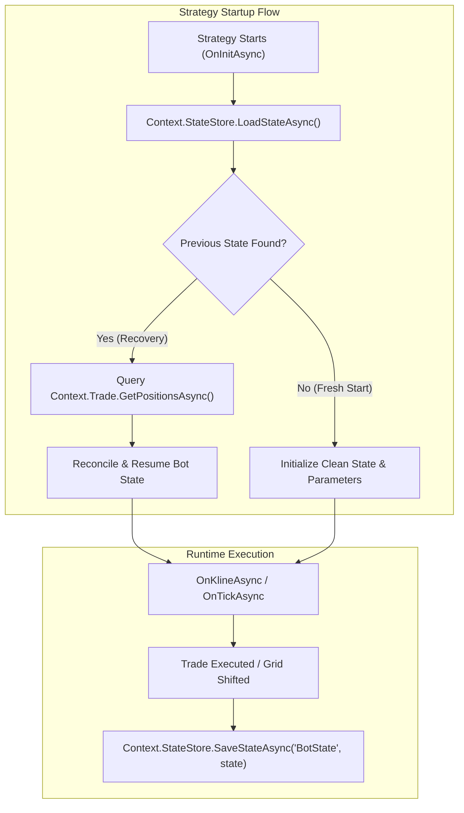

# State Management & Crash Recovery

In live algorithmic trading, strategies must be resilient against process restarts, operating system reboots, and network disconnections. Complex strategies such as **Grid Bots**, **DCA (Dollar Cost Averaging)**, or **Trailing Stop managers** maintain internal state (e.g., active grid levels, order IDs, high-water marks, and cumulative session PnL).

The Platinum Trade SDK provides built-in state persistence (`IStrategyStateStore`) and scoped storage path resolution (`IStoragePathProvider`) to enable zero-loss crash recovery.

---

## Architecture Overview



---

## 1. Defining a Strategy State Model

Create a serializable data class representing the state variables you need to persist across restarts:

```csharp
public class GridBotState
{
    public DateTime LastUpdatedUtc { get; set; }
    public decimal EntryPrice { get; set; }
    public decimal HighestPriceSeen { get; set; }
    public int ActiveLayerCount { get; set; }
    public List<long> PendingOrderIds { get; set; } = new();
    public decimal RealizedSessionPnl { get; set; }
}
```

---

## 2. Saving and Loading State

Use `Context.StateStore` (or your injected state manager) to persist and retrieve state:

```csharp
using Pt.Okx.Sdk.Strategy;

public class ResilientGridStrategy : StrategyBase
{
    private const string StateKey = "GridBot_ActiveState";
    private GridBotState _state = new();

    public override async Task OnInitAsync()
    {
        // 1. Attempt to load previous state
        var savedState = await Context.StateStore.LoadStateAsync<GridBotState>(StateKey);

        if (savedState != null)
        {
            Context.Logger.LogInformation("Recovery", $"Found existing state from {savedState.LastUpdatedUtc:yyyy-MM-dd HH:mm:ss} UTC. Reconciling...");
            _state = savedState;

            // 2. Reconcile with live exchange positions
            await ReconcileWithExchangeAsync();
        }
        else
        {
            Context.Logger.LogInformation("Init", "No prior state found. Starting fresh session.");
            _state = new GridBotState
            {
                LastUpdatedUtc = Context.Timeseries.GetCurrentTime(),
                HighestPriceSeen = Context.Timeseries.CurrentTickPrice
            };
            await Context.StateStore.SaveStateAsync(StateKey, _state);
        }
    }

    private async Task ReconcileWithExchangeAsync()
    {
        // Query open positions on OKX
        var posRes = await Context.Trade.GetPositionsAsync();
        if (posRes.Success && posRes.Data.Length > 0)
        {
            var primaryPos = posRes.Data.FirstOrDefault(p => p.Symbol == "BTC-USDT-SWAP");
            if (primaryPos != null)
            {
                Context.Logger.LogInformation("Reconcile", $"Re-attached to active position: Qty={primaryPos.PositionQuantity}, PnL={primaryPos.UnrealizedPnl}");
            }
        }
    }

    public override async Task OnKlineAsync(CandleData candle)
    {
        // Update high water mark
        if (candle.High > _state.HighestPriceSeen)
        {
            _state.HighestPriceSeen = candle.High;
            _state.LastUpdatedUtc = Context.Timeseries.GetCurrentTime();

            // Persist updated state to disk
            await Context.StateStore.SaveStateAsync(StateKey, _state);
        }
    }
}
```

---

## 3. Custom File & Data Storage (`IStoragePathProvider`)

If your strategy loads external machine learning models, custom CSV datasets, or writes daily audit reports, use `Context.Storage` to resolve safe file paths without hardcoding directory locations.

```csharp
// Resolve the dedicated directory for this strategy plugin
string dataDir = Context.Storage.GetDataDirectory();
string reportPath = Path.Combine(dataDir, $"trade_report_{DateTime.UtcNow:yyyyMMdd}.csv");

// Write custom report safely
await File.AppendAllTextAsync(reportPath, $"{DateTime.UtcNow},{candle.Close},{_state.RealizedSessionPnl}\n");
```

> [!TIP]
> `IStoragePathProvider` automatically handles sandbox isolation across different operating systems and deployment packages (e.g., Velopack local app data).

---

## 4. Resetting State upon Strategy Completion

When a grid or DCA cycle finishes and all positions are closed, clean up the stored state so subsequent runs start with a fresh slate:

```csharp
private async Task OnCycleCompletedAsync()
{
    Context.Logger.LogInformation("Cycle", "Take profit target reached. Clearing state...");
    
    // Delete state record
    await Context.StateStore.DeleteStateAsync(StateKey);
    
    // Reset memory reference
    _state = new GridBotState();
}
```

---

## Best Practices Checklist

| Practice | Recommendation |
| :--- | :--- |
| **Atomic Updates** | Save state immediately after critical order executions or significant parameter shifts. |
| **Exchange Verification** | Never trust local state blindly upon startup; cross-reference with `Context.Trade.GetPositionsAsync()` to detect manual closes or liquidation events while the bot was offline. |
| **Versioned State Models** | If you update your strategy DLL with new properties, provide default values for legacy saved state fields to avoid deserialization errors. |
| **Cleanup on Exit** | Implement `OnDeinitAsync()` or cycle-completion hooks to clear stale records. |

---

## Related Documentation

- [Strategy Plugin Architecture](../plugins/strategy/state-management.md) — Core state management architecture.
- [Storage API Reference](../api-reference/storage/index.md) — Detailed methods on `IStoragePathProvider`.
- [Trade Client API Reference](../api-reference/client/trade.md) — Reconciling positions with `GetPositionsAsync`.
- [Debugging Guide](./debugging.md) — Testing state recovery in Visual Studio.
