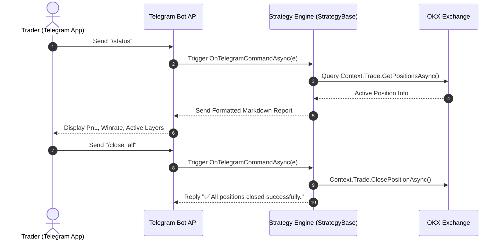

# Interactive Telegram Bot Commands & Alerts

Real-time monitoring and remote control are vital for automated crypto trading. The Platinum Trade SDK provides deep integration with Telegram, allowing strategies to:

1. **Broadcast Alerts**: Send instant notifications on order fills, stop-loss triggers, or margin warnings.
2. **Interactive Remote Control (Two-Way)**: Accept custom slash commands from traders (e.g., `/status`, `/pause`, `/close_all`, `/set_tp 75000`) and reply with live statistics or action confirmation.

---

## Architecture Overview



---

## 1. Sending Outbound Trade Alerts

Use `Context.Notify` to send formatted messages directly to the configured Telegram chat:

```csharp
public override async Task OnKlineAsync(CandleData candle)
{
    if (signalBuy)
    {
        var res = await Context.Trade.PlaceOrderAsync("BTC-USDT-SWAP", OrderSide.Buy, OrderType.Market, 1.0m);
        if (res.Success)
        {
            string message = 
                $"🚀 <b>BUY Order Placed</b>\n" +
                $"• <b>Symbol:</b> <code>BTC-USDT-SWAP</code>\n" +
                $"• <b>Price:</b> <code>{candle.Close:F2}</code>\n" +
                $"• <b>Time:</b> <code>{Context.Timeseries.GetCurrentTime():yyyy-MM-dd HH:mm:ss} UTC</code>";

            await Context.Notify.SendTelegramMessageAsync(message);
        }
    }
}
```

> [!TIP]
> Use standard HTML formatting tags (`<b>`, `<i>`, `<code>`, `<pre>`) for crisp and structured Telegram messages.

---

## 2. Handling Two-Way Telegram Commands

Override `OnTelegramCommandAsync` in your `StrategyBase` class to process inbound commands sent from the Telegram chat:

```csharp
using Pt.Okx.Sdk.Strategy;
using Pt.Okx.Sdk.Strategy.Events;

public class TelegramInteractiveStrategy : StrategyBase
{
    private bool _isPaused = false;

    public override async Task OnTelegramCommandAsync(TradeCommandTelegramEvent e)
    {
        string command = e.Command.ToLowerInvariant().Trim();
        string[] args = e.Arguments ?? Array.Empty<string>();

        switch (command)
        {
            case "/status":
                await HandleStatusAsync(e);
                break;

            case "/pause":
                _isPaused = true;
                await e.ReplyAsync("⏸️ <b>Strategy Paused</b>. New trade entries are disabled.");
                break;

            case "/resume":
                _isPaused = false;
                await e.ReplyAsync("▶️ <b>Strategy Resumed</b>. Scanning for market opportunities.");
                break;

            case "/close_all":
                await HandleCloseAllAsync(e);
                break;

            default:
                await e.ReplyAsync($"❓ <i>Unknown command: {command}</i>. Available: <code>/status</code>, <code>/pause</code>, <code>/resume</code>, <code>/close_all</code>");
                break;
        }
    }

    private async Task HandleStatusAsync(TradeCommandTelegramEvent e)
    {
        var posRes = await Context.Trade.GetPositionsAsync();
        decimal equity = Context.Account.Equity;
        decimal wallet = Context.Account.WalletBalance;
        decimal pnl = Context.Account.UnrealizedPnL;

        string report = 
            $"📊 <b>Strategy Status Report</b>\n" +
            $"───────────────────\n" +
            $"• <b>Status:</b> {(_isPaused ? "⏸️ Paused" : "🟢 Running")}\n" +
            $"• <b>Wallet:</b> <code>{wallet:F2} USDT</code>\n" +
            $"• <b>Equity:</b> <code>{equity:F2} USDT</code>\n" +
            $"• <b>Unrealized PnL:</b> <code>{(pnl >= 0 ? "+" : "")}{pnl:F2} USDT</code>\n" +
            $"• <b>Active Positions:</b> <code>{posRes.Data?.Length ?? 0}</code>";

        await e.ReplyAsync(report);
    }

    private async Task HandleCloseAllAsync(TradeCommandTelegramEvent e)
    {
        var posRes = await Context.Trade.GetPositionsAsync();
        if (posRes.Success && posRes.Data.Length > 0)
        {
            foreach (var pos in posRes.Data)
            {
                await Context.Trade.ClosePositionAsync(pos.Symbol, pos.PositionSide);
            }
            await e.ReplyAsync("✅ <b>Emergency Action:</b> All open positions closed.");
        }
        else
        {
            await e.ReplyAsync("ℹ️ No open positions to close.");
        }
    }
}
```

---

## 3. Parsing Command Arguments

Commands can accept dynamic parameters (e.g., `/set_risk 2.5` or `/order buy 0.5`):

```csharp
case "/set_risk":
    if (args.Length > 0 && decimal.TryParse(args[0], out decimal newRisk))
    {
        _riskPercentage = newRisk;
        await e.ReplyAsync($"✅ Risk per trade updated to <code>{_riskPercentage}%</code>.");
    }
    else
    {
        await e.ReplyAsync("⚠️ Usage: <code>/set_risk &lt;percentage&gt;</code> (e.g., <code>/set_risk 2.5</code>)");
    }
    break;
```

---

## Best Practices Checklist

| Practice | Recommendation |
| :--- | :--- |
| **Authentication & Chat Security** | Ensure your bot token and authorized chat IDs are kept confidential in strategy settings or secure configuration files. |
| **Rate Limiting** | Avoid spamming Telegram API in tight loops; batch status messages or trigger only on state transitions. |
| **Clear Command Feedback** | Always reply to user commands (even on errors) so the operator knows the command was received and processed. |
| **HTML Formatting** | Use `<code>` tags for numbers, symbols, and IDs to make them easily readable and copyable on mobile devices. |

---

## Related Documentation

- [Strategy Plugin Telegram Architecture](../plugins/strategy/telegram-commands.md) — Architectural overview of Telegram command extensions.
- [Notification Client API Reference](../api-reference/notifications/index.md) — Methods and options for `Context.Notify`.
- [State Management Guide](./state-persistence.md) — Preserving command configurations across restarts.
- [Trade Client API Reference](../api-reference/client/trade.md) — Executing remote trade orders from Telegram.
