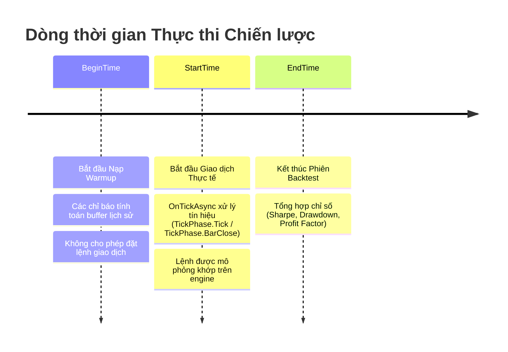

# Cơ chế Backtest & Tối ưu hóa Hiệu năng

Backtesting (kiểm thử quá khứ) là nền tảng của giao dịch định lượng. Nó cho phép bạn kiểm chứng giả thuyết, hiệu chỉnh tham số quản lý rủi ro và đo lường mức sụt giảm vốn (drawdown) trong quá khứ trước khi giao dịch vốn thật. Nền tảng Platinum Trade cung cấp engine backtest theo cơ chế hướng sự kiện (event-driven) mô phỏng khớp lệnh thực tế trên dữ liệu lịch sử.

Tài liệu này giải thích vòng đời backtest, các chế độ dữ liệu và kỹ thuật tối ưu hóa hiệu năng để chạy kiểm thử và tối ưu tham số nhanh nhất.

---

## Vòng đời Thực thi Backtest

Dòng thời gian thực thi của một phiên backtest được chia thành hai giai đoạn rõ rệt: **Giai đoạn Nạp dữ liệu đệm (Warmup Phase)** và **Giai đoạn Mô phỏng Giao dịch (Active Simulation Phase)**.



### 1. Giai đoạn Warmup (`BeginTime` $\rightarrow$ `StartTime`)
- Trước khi chiến lược bắt đầu giao dịch, hệ thống tự động tải một lượng nến lịch sử trước thời điểm `StartTime` để khởi tạo các chỉ báo kỹ thuật (ví dụ: cần 200 nến cho đường EMA 200).
- Trong giai đoạn này, các chỉ báo tính toán buffer nội bộ, nhưng **không có lệnh giao dịch nào được gửi đi**.
- Bạn có thể kiểm tra [`Context.Timeseries.BeginTime`](../api-reference/client/timeseries-and-indicators/timeseries.md#begintime) và [`Context.Timeseries.StartTime`](../api-reference/client/timeseries-and-indicators/timeseries.md#starttime).

### 2. Giai đoạn Mô phỏng Giao dịch (`StartTime` $\rightarrow$ `EndTime`)
- Engine mô phỏng dòng giá theo độ phân giải dữ liệu đã chọn (`PriceDataOption`).
- Mọi lệnh đặt qua `Context.Trade` được định tuyến đến simulator nội bộ để tính toán khớp lệnh, trượt giá (slippage) và phí giao dịch.
- [`Context.Timeseries.GetCurrentTime()`](../api-reference/client/timeseries-and-indicators/timeseries.md#getcurrenttime) trả về mốc thời gian lịch sử đang mô phỏng, **không phải** đồng hồ thực của máy tính.

---

## Các Chế độ Dữ liệu Giá (Price Data Options)

Khi thiết lập phiên backtest trên Platinum Trade, bạn có thể lựa chọn các mô hình dữ liệu:

| Chế độ | Độ chính xác | Tốc độ | Khi nào nên dùng |
| :--- | :--- | :--- | :--- |
| **Chỉ nến đóng** (`OpenCloseHighLow`) | Tiêu chuẩn | ⚡⚡⚡ Tối đa | Tốt nhất cho chiến lược xử lý theo nến đóng (`tickPhase == TickPhase.BarClose`), quét dải tham số và tối ưu di truyền (Genetic Optimization). |
| **Nội suy 1 Phút** (`OneMinute`) | Cao | ⚡⚡ Nhanh | Mô phỏng biến động trong nến dựa trên nến 1 phút lịch sử. Phù hợp cho kiểm tra Trailing Stop và Cắt lỗ (Stop Loss). |
| **Từng Tick thực tế** (`Tick`) | Siêu chính xác | ⚡ Chi tiết | Dùng dữ liệu tick lịch sử thực tế. Bắt buộc đối với bot Scalping, giao dịch cao tần (HFT) và mô phỏng sổ lệnh (Order Book). |

---

## Viết Code Đồng nhất: Backtest vs. Live Mode

Để chiến lược hoạt động đồng nhất và chính xác giữa môi trường backtest và tài khoản thật:

### 1. Luôn dùng `GetCurrentTime()` thay vì `DateTime.UtcNow`
Trong backtest, `DateTime.UtcNow` trả về thời gian thực của máy tính, làm sai lệch bộ lọc khung giờ giao dịch (như phiên London, phiên New York).

```csharp
// ❌ SAI: Dùng đồng hồ máy tính trong backtest
DateTime now = DateTime.UtcNow;

// ✅ ĐÚNG: Trả về thời gian mô phỏng trong backtest, và UTC thực trong live
DateTime now = Context.Timeseries.GetCurrentTime();
if (now.Hour == 8 && now.Minute == 0)
{
    // Kích hoạt chính xác lúc 08:00 UTC dù ở Backtest hay Live
}
```

### 2. Phân biệt môi trường Backtest và Live
Bạn có thể kiểm tra `Context.Timeseries.EndTime`:

```csharp
bool isBacktest = Context.Timeseries.EndTime.HasValue;
if (!isBacktest)
{
    // Chỉ gửi thông báo Telegram khi chạy trên tài khoản thật
    await Context.Notify.SendTelegramMessageAsync("Đã khớp lệnh tài khoản thật!");
}
```

---

## Kỹ thuật Tối ưu hóa Hiệu năng CPU

Backtest tốc độ cao giúp bạn kiểm thử hàng ngàn bộ tham số trong vài giây. Hãy áp dụng các kỹ thuật sau:

### 1. Sử dụng API Copy Vector hóa
Thay vì gọi `GetOHLCVAsync` trong vòng lặp `for`:

```csharp
// ❌ CHẬM: Nhiều cuộc gọi async lặp lại
decimal sum = 0;
for (int i = 1; i <= 50; i++)
{
    var candle = await Context.Timeseries.GetOHLCVAsync(shift: i);
    sum += candle.Close;
}

// ✅ NHANH: Copy 1 lần nguyên mảng vào bộ nhớ liên tục
decimal[] closes = await Context.Timeseries.CopyCloses(startPos: 1, count: 50);
decimal sum = closes.Sum();
```

### 2. Hiểu rõ Cơ chế Tính toán Chỉ báo
Mặc định, SDK tính toán chỉ báo **1 lần duy nhất lúc mở nến mới**.

- Nếu chiến lược giao dịch theo nến đóng (`tickPhase == TickPhase.BarClose`), buffer chỉ báo đã sẵn sàng. **Không** cần gọi `UpdateOpenCandleIndicators()`.
- Chỉ gọi [`Context.Timeseries.UpdateOpenCandleIndicators()`](../api-reference/client/timeseries-and-indicators/timeseries.md#updateopencandleindicators) bên trong `OnTickAsync` khi `tickPhase == TickPhase.Tick` nếu chiến lược bắt buộc phải lấy giá trị chỉ báo theo từng tick biến động của nến đang hình thành.

```csharp
public override async Task OnTickAsync(TickPhase tickPhase, CancellationToken ct)
{
    if (tickPhase == TickPhase.Tick)
    {
        // Chỉ gọi khi thật sự cần giá trị nến đang mở theo tick
        Context.Timeseries.UpdateOpenCandleIndicators();
        double intraBarRsi = _rsi.GetValue(0); // Giá trị phản ánh theo tick hiện tại
    }
}
```

### 3. Hạn chế Cấp phát Bộ nhớ Heap trong `OnTickAsync`
Hàm `OnTickAsync` có thể chạy hàng triệu lần trong một phiên backtest. Tránh tạo chuỗi ký tự (string interpolation) hay cấp phát object không cần thiết trên mỗi tick:

```csharp
// ❌ CHẬM: Tạo chuỗi liên tục trên mỗi tick
Context.Logger.LogInformation("Tick", $"Giá={Context.Timeseries.CurrentTickPrice} lúc {DateTime.Now}");

// ✅ NHANH: Chỉ thực thi logic nặng và ghi log khi đóng nến hoặc đổi trạng thái
if (tickPhase == TickPhase.BarClose && signalTriggered)
{
    Context.Logger.LogInformation("Signal", $"Khớp tín hiệu tại giá: {Context.Timeseries.CurrentTickPrice}");
}
```

---

## Tài liệu Liên quan

- [Hướng dẫn Debugging](./debugging.md) — Debug backtest với Breakpoint trên Visual Studio.
- [Chiến lược Đa khung thời gian](./multi-timeframe.md) — Xử lý MTF trong backtest tránh Look-ahead bias.
- [Tra cứu Timeseries API](../api-reference/client/timeseries-and-indicators/timeseries.md) — Chi tiết về `CopySeries` và `UpdateOpenCandleIndicators`.
- [Quản lý Trạng thái & Lưu trữ](./state-persistence.md) — Quản lý state giữa các phiên backtest và restart live.
