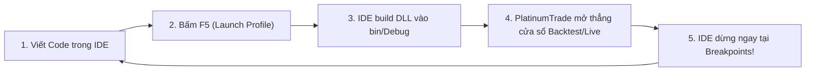

# Hướng dẫn Debug Chiến lược & Chỉ báo

Tài liệu này hướng dẫn chi tiết cách debug các plugin **Chiến lược (Strategy)** và **Chỉ báo (Indicator)** tùy biến trên **Visual Studio**, **JetBrains Rider**, hoặc **VS Code** với khả năng dừng tại breakpoint theo thời gian thực.

---

## Phân biệt Cơ chế Thực thi

Trước khi bắt đầu, cần lưu ý sự khác biệt giữa hai loại plugin:

| Loại Plugin | Cơ chế Thực thi | Cách Debug Tối ưu |
| :--- | :--- | :--- |
| **Strategy Plugin** (`IStrategy`) | Chạy trong tiến trình con độc lập (`--strategy-host`). | Dùng `launchSettings.json` với profile `--strategy-host` để **F5 mở thẳng cửa sổ Backtest/Live**. |
| **Indicator Plugin** (`IIndicatorPlugin`) | Chạy trực tiếp trên tiến trình giao diện chính (vẽ nến/chart) hoặc được gọi lồng bên trong một Strategy. | **Cách 1**: Khởi chạy App chính (F5/Attach) và nạp DLL lên biểu đồ Chart.<br/>**Cách 2**: Nhúng chỉ báo vào một Strategy để debug qua luồng Backtest F5. |

---

# PHẦN 1: Debug Chiến lược Giao dịch (Strategy Plugin)

## 1. Cơ chế Inner Dev-Loop

PlatinumTrade cho phép bạn bỏ qua việc mở dashboard chính và chọn lại file DLL mỗi lần sửa code. Bạn có thể cấu hình IDE để khởi chạy trực tiếp cửa sổ thực thi chiến lược:



### Bước 1: Thiết lập 1 lần đầu trên PlatinumTrade App

1. Mở ứng dụng **PlatinumTrade.exe**.
2. Chuyển sang tab **Strategy Configuration**.
3. Bấm **Browse** và chọn file DLL đã biên dịch của project:
   ```
   <ThuMucProjectCuaBan>/bin/Debug/net10.0/<TenStrategy>.dll
   ```
4. Chọn **Cặp tiền** (ví dụ `BTC-USDT`), **Khung thời gian** (ví dụ `1m`), **Khoảng thời gian Backtest**, và các **Input Parameters** mong muốn.
5. Bấm **Start Backtest** (hoặc **Start Live**) chạy thử một lần.

> [!TIP]
> Lần chạy này sẽ lưu đường dẫn DLL, cấu hình cặp tiền và tham số vào ổ đĩa. Các lần khởi chạy F5 trực tiếp từ IDE sau đó sẽ tự động đọc lại các thiết lập này.

---

### Bước 2: Cấu hình `launchSettings.json` trong Project Chiến lược

Trong project chiến lược, cấu hình file `Properties/launchSettings.json`:

```json
{
  "profiles": {
    "Backtest": {
      "commandName": "Executable",
      "executablePath": "%LocalAppData%\\PlatinumTrade\\current\\PlatinumTrade.exe",
      "commandLineArgs": "--strategy-host --mode=backtest",
      "workingDirectory": "$(TargetDir)"
    },
    "Live": {
      "commandName": "Executable",
      "executablePath": "%LocalAppData%\\PlatinumTrade\\current\\PlatinumTrade.exe",
      "commandLineArgs": "--strategy-host --mode=live",
      "workingDirectory": "$(TargetDir)"
    }
  }
}
```

> [!NOTE]
> Ứng dụng PlatinumTrade được cài đặt qua Velopack mặc định tại thư mục `%LocalAppData%\PlatinumTrade\current\PlatinumTrade.exe` (hoặc đường dẫn `bin\Debug\...` nếu bạn đang chạy từ mã nguồn App).

---

### Bước 3: Đặt Breakpoint & Bấm F5

1. Mở file mã nguồn chiến lược (ví dụ `MyStrategy.cs`).
2. Đặt breakpoint (bấm **F9**) bên trong `OnInitAsync` hoặc `RunAsync`.
3. Trong Visual Studio / Rider, chọn profile **Backtest** từ thanh công cụ chạy.
4. Bấm **F5** (Start Debugging).

```csharp
public async Task RunAsync(
    StrategyEventType eventType,
    IStrategyStateStore state,
    CancellationToken ct)
{
    // Đặt breakpoint tại đây:
    if (eventType == StrategyEventType.Kline)
    {
        var candle = await _client.Timeseries.GetCurrentCandleAsync(ct: ct);
        
        // Xem biến trong cửa sổ Autos / Watch của Visual Studio
        _logger.LogInformation("Signal", "Kiểm tra tín hiệu tại giá đóng nến: {Close}", candle.Close);
    }
}
```

---

## 2. Điều chỉnh Tham số Chiến lược khi Đang Debug

- **Cách 1 (Sửa trực tiếp trong code - Nhanh nhất)**: Chỉnh sửa thuộc tính `DefaultValue` của tham số trong class `IStrategyInput`:
  ```csharp
  [InputParameter(Name = "Fast EMA", DefaultValue = 14)]
  public int FastPeriod { get; set; } = 14;
  ```
  Khi bấm **F5**, host sẽ tự động đọc giá trị mặc định mới nhất từ file DLL vừa build.
- **Cách 2 (Chỉnh trên UI)**: Mở ứng dụng chính, điều chỉnh lại tham số trên giao diện và bấm chạy một lần để lưu bộ tham số mới.

---

# PHẦN 2: Debug Plugin Chỉ báo (Indicator Plugin)

Chỉ báo không chạy qua cờ `--strategy-host` độc lập như chiến lược mà được tính toán trực tiếp trên biểu đồ của App chính hoặc được gọi từ trong logic của chiến lược.

## Cách 1: Debug Chỉ báo Trực tiếp trên Biểu đồ (Khuyên dùng)

### 1. Cấu hình Launch Profile cho Project Chỉ báo

Tạo file `Properties/launchSettings.json` trong project chỉ báo để khởi chạy ứng dụng PlatinumTrade chính:

```json
{
  "profiles": {
    "PlatinumTrade App": {
      "commandName": "Executable",
      "executablePath": "%LocalAppData%\\PlatinumTrade\\current\\PlatinumTrade.exe",
      "workingDirectory": "$(TargetDir)"
    }
  }
}
```

### 2. Thực hiện Debug

1. Đặt breakpoint trong hàm `Calculate(int index)` hoặc constructor của class chỉ báo (kế thừa `CalcIndBase`).
2. Bấm **F5** từ Visual Studio để mở giao diện chính PlatinumTrade.
3. Trên biểu đồ nến, vào menu **Indicators > Plugins > Load Plugin DLL** và chọn DLL chỉ báo từ thư mục `bin/Debug/` của project bạn.
4. Thêm chỉ báo vào biểu đồ.
5. Khi biểu đồ vẽ và tính toán nến, Visual Studio sẽ **dừng ngay tại breakpoint** trong hàm `Calculate` của bạn.

> [!TIP]
> Bạn cũng có thể mở App chính từ trước, sau đó trong Visual Studio chọn **Debug > Attach to Process...** (`Ctrl + Alt + P`) -> chọn tiến trình `PlatinumTrade.exe` rồi nạp/tải lại chỉ báo trên biểu đồ.

---

## Cách 2: Debug Chỉ báo Lồng bên trong Chiến lược (Strategy Harness)

Nếu chỉ báo của bạn phục vụ cho một chiến lược cụ thể, bạn có thể nhúng chỉ báo đó vào project chiến lược để debug chung qua luồng Backtest F5:

1. Đăng ký/gọi plugin chỉ báo bên trong chiến lược:
   ```csharp
   // Trong OnInitAsync hoặc constructor chiến lược
   var customIndicator = await _client.Timeseries.GetCustomIndicatorAsync<MyCustomIndicator>("MyIndicatorName");
   ```
2. Đặt breakpoint bên trong file mã nguồn của chỉ báo.
3. Chạy profile **Backtest** (F5) của Chiến lược. Khi backtest chạy qua từng nến lịch sử, hàm tính toán của chỉ báo sẽ được gọi và kích hoạt breakpoint liên tục.

---

# Kỹ thuật Hỗ trợ Nâng cao

### 1. Kích hoạt JIT Debugger (`Debugger.Launch`)

Thêm đoạn mã sau vào `OnInitAsync` của chiến lược hoặc constructor của chỉ báo:

```csharp
#if DEBUG
if (!System.Diagnostics.Debugger.IsAttached)
{
    System.Diagnostics.Debugger.Launch();
}
#endif
```

Khi ứng dụng chạy đến đoạn mã này, Windows sẽ hiển thị popup **Visual Studio Just-In-Time Debugger** để bạn chọn IDE và gắn debugger vào ngay lập tức.

---

### 2. Viết Unit Test cho Chiến lược & Chỉ báo (Không cần bật GUI)

Bạn có thể tạo project Unit Test để kiểm thử công thức toán học và logic tín hiệu cực nhanh bằng Test Runner của IDE:

```csharp
[Test]
public void Calculate_GivenValidCandles_CalculatesExpectedBuffer()
{
    var indicator = new MyCustomIndicator();
    // Khởi tạo buffer giả lập và kiểm tra kết quả tính toán
    indicator.Calculate(0);
    Assert.That(indicator.Values[0], Is.GreaterThan(0));
}
```

---

## Xử lý Sự cố Thường gặp

| Vấn đề | Nguyên nhân | Cách khắc phục |
| :--- | :--- | :--- |
| **Breakpoint báo "The breakpoint will not currently be hit"** | File `.pdb` chưa được nạp hoặc file DLL đang trỏ vào sai thư mục. | Đảm bảo project đang chọn cấu hình `Debug`. Kiểm tra lại xem `PlatinumTrade.exe` có đang nạp đúng DLL trong thư mục `bin/Debug/` hay không. |
| **F5 không dừng ở breakpoint của Chỉ báo** | Chạy profile `--strategy-host` vốn chỉ dành cho Chiến lược. | Chuyển sang profile chạy App chính (không có `--strategy-host`) và gắn chỉ báo lên biểu đồ, hoặc nhúng chỉ báo vào một Strategy để debug. |
| **Không nạp được cấu hình khi bấm F5** | Chưa từng chạy thử trên giao diện GUI trước đó. | Mở App chính chạy thử 1 lần để lưu thông tin cấu hình vào đĩa. |

---

## Tài liệu Liên quan

- [Hướng dẫn Bắt đầu (Getting Started)](./getting-started.md)
- [Phát triển Plugin Chỉ báo](../plugins/indicator/overview.md)
- [Tham chiếu Tham số Đầu vào (Input Parameters)](../plugins/strategy/input-parameters.md)
- [Tổng quan Vòng đời Chiến lược](../plugins/strategy/overview.md)
