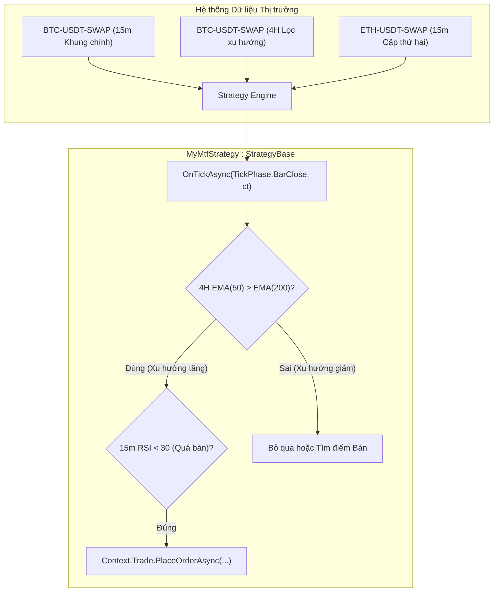

# Chiến lược Đa khung thời gian & Đa tài sản

Trong giao dịch định lượng và thuật toán, các chiến lược chỉ dựa vào một khung thời gian đơn lẻ thường dễ bị nhiễu thị trường. **Phân tích Đa khung thời gian (Multi-Timeframe - MTF)** cho phép chiến lược lọc xu hướng lớn từ khung thời gian cao (như 4 Giờ hoặc 1 Ngày) và tìm điểm vào lệnh tối ưu ở khung thời gian nhỏ (như 5 Phút hoặc 15 Phút). Ngoài ra, khả năng **Đa tài sản (Multi-Symbol)** giúp xây dựng các chiến lược danh mục, kinh doanh chênh lệch giá (Arbitrage) hoặc giao dịch theo cặp (Pairs Trading).

Tài liệu này hướng dẫn chi tiết cách xây dựng chiến lược đa khung thời gian và đa tài sản với Platinum Trade SDK.

---

## Kiến trúc Tổng quan



1. **Cặp chính và Cặp phụ**:
   - Symbol và khung thời gian chính được cấu hình trên giao diện ứng dụng hoặc file cấu hình launch profile.
   - Các symbol và timeframe phụ được khai báo động khi bạn khởi tạo chỉ báo qua `Context.Timeseries.CreateIndicator*`.
2. **Cơ chế Đăng ký Dữ liệu Tự động**:
   - Khi bạn tạo chỉ báo với tham số `(symbol, timeframe)` cụ thể, SDK tự động đăng ký cặp đó vào [`Context.Timeseries.SymbolsTimeframes`](../api-reference/client/timeseries-and-indicators/timeseries.md#symbolstimeframes).
   - Hệ thống tự động nạp dữ liệu nến lịch sử (warmup) và đăng ký luồng dữ liệu thời gian thực cho các cặp này.
3. **Tránh Lỗi Nhìn Trước Tương Lai (Look-Ahead Bias)**:
   - Khi tham chiếu dữ liệu khung cao (HTF) từ vòng lặp thực thi của khung nhỏ (LTF), luôn sử dụng **nến đã đóng** (`shift: 1` hoặc `GetValue(1)`) để tránh đọc giá trị nến HTF chưa hoàn thiện.

---

## 1. Khởi tạo Chỉ báo Đa khung thời gian

Để tạo chỉ báo cho khung thời gian khác với khung chính của chiến lược, truyền rõ tham số `symbol` và `timeframe` trong hàm `OnInitAsync()`:

```csharp
using Pt.Okx.Sdk.Clients.Market.Models;
using Pt.Okx.Sdk.Enums;
using Pt.Okx.Sdk.Indicators.BuiltIn;
using Pt.Okx.Sdk.Indicators.Enums;
using Pt.Okx.Sdk.Strategy;

public class TrendFilterMtfStrategy : StrategyBase
{
    // Chỉ báo khung thời gian cao (4 Giờ) để xác định xu hướng
    private IIndicatorMA _htfFastEma = null!;
    private IIndicatorMA _htfSlowEma = null!;

    // Chỉ báo khung thời gian chính (15 Phút) để tìm điểm vào lệnh
    private IIndicatorRSI _ltfRsi = null!;

    public override Task<bool> OnInitAsync(IStrategyStateStore state, CancellationToken cancellationToken)
    {
        // 1. Khởi tạo bộ lọc xu hướng 4H (Chỉ định Timeframe.FourHours)
        _htfFastEma = Context.Timeseries.CreateIndicatorMA(
            symbol: null, // null sẽ lấy symbol chính của chiến lược
            timeframe: Timeframe.FourHours,
            period: 50,
            method: MaMethod.Ema,
            appliedPrice: AppliedPrice.Close,
            indicatorAlias: "4H_EMA50"
        );

        _htfSlowEma = Context.Timeseries.CreateIndicatorMA(
            symbol: null,
            timeframe: Timeframe.FourHours,
            period: 200,
            method: MaMethod.Ema,
            appliedPrice: AppliedPrice.Close,
            indicatorAlias: "4H_EMA200"
        );

        // 2. Khởi tạo chỉ báo kích hoạt 15m (null sẽ lấy timeframe chính)
        _ltfRsi = Context.Timeseries.CreateIndicatorRSI(
            symbol: null,
            timeframe: null, // Mặc định theo timeframe chính (ví dụ: 15m)
            period: 14,
            indicatorAlias: "15M_RSI14"
        );

        Context.Logger.LogInformation("Init", "Khởi tạo chỉ báo MTF thành công.");
        return Task.FromResult(true);
    }

    public override Task<bool> OnStopAsync(CancellationToken cancellationToken) => Task.FromResult(true);
}
```

> [!TIP]
> Đặt `indicatorAlias` giúp bạn phân biệt các đường chỉ báo và log trên biểu đồ khi debug.

---

## 2. Xử lý Logic Giao dịch với Chỉ số Nến Chuẩn

Trong hàm `OnTickAsync(TickPhase tickPhase, CancellationToken ct)`, bạn kiểm tra `if (tickPhase != TickPhase.BarClose) return;` để code được kích hoạt chính xác mỗi khi nến chính đóng (ví dụ mỗi 15 phút). Bạn truy xuất giá trị EMA 4H đóng gần nhất qua index `1`:

```csharp
public override async Task OnTickAsync(TickPhase tickPhase, CancellationToken ct)
{
    // Chỉ thực thi logic khi nến khung chính vừa đóng
    if (tickPhase != TickPhase.BarClose) return;

    // 1. Đọc giá trị 2 đường EMA 4H tại nến vừa đóng (Shift 1 = nến 4H đã đóng)
    double htfFast = _htfFastEma.GetValue(1);
    double htfSlow = _htfSlowEma.GetValue(1);

    if (double.IsNaN(htfFast) || double.IsNaN(htfSlow))
    {
        // Dữ liệu đệm đang nạp
        return;
    }

    bool isBullishTrend = htfFast > htfSlow;
    bool isBearishTrend = htfFast < htfSlow;

    // 2. Đọc giá trị RSI 15m tại nến vừa đóng
    double ltfRsi = _ltfRsi.GetValue(1);

    // 3. Đánh giá điều kiện vào lệnh
    if (isBullishTrend && ltfRsi < 30)
    {
        Context.Logger.LogInformation("Signal", $"Tín hiệu Mua MTF: Xu hướng 4H TĂNG, RSI 15m={ltfRsi:F2} Quá bán.");

        // Kiểm tra xem đã có vị thế mở hay chưa
        var posRes = await Context.Trade.GetPositionsAsync(ct: ct);
        if (posRes.Success && posRes.Data.Length == 0)
        {
            await Context.Trade.PlaceOrderAsync(
                symbol: "BTC-USDT-SWAP",
                side: OrderSide.Buy,
                type: OrderType.Market,
                quantity: 1.0m,
                ct: ct
            );
        }
    }
}
```

> [!IMPORTANT]
> **Quy tắc Tránh Look-Ahead Bias**:
> - Luôn sử dụng `_indicator.GetValue(1)` khi đọc chỉ báo khung thời gian cao từ vòng lặp khung nhỏ.
> - Vị trí index `0` đại diện cho nến *đang hình thành*, giá trị này biến đổi liên tục trong suốt 4 tiếng và chỉ cố định khi nến đóng. Nếu dùng `GetValue(0)` trong backtest sẽ gây ra kết quả ảo không thể tái hiện trên tài khoản thật.

---

## 3. Giao dịch Nhiều Cặp Tiền Đồng thời (Pairs Trading)

Platinum Trade SDK cho phép một chiến lược theo dõi và mở lệnh trên nhiều mã giao dịch cùng lúc:

```csharp
public class PairsTradingStrategy : StrategyBase
{
    private const string BtcSymbol = "BTC-USDT-SWAP";
    private const string EthSymbol = "ETH-USDT-SWAP";

    private IIndicatorMA _btcSma = null!;
    private IIndicatorMA _ethSma = null!;

    public override Task<bool> OnInitAsync(IStrategyStateStore state, CancellationToken cancellationToken)
    {
        // Đăng ký chỉ báo SMA 1H cho BTC
        _btcSma = Context.Timeseries.CreateIndicatorMA(
            symbol: BtcSymbol,
            timeframe: Timeframe.OneHour,
            period: 20
        );

        // Đăng ký chỉ báo SMA 1H cho ETH
        _ethSma = Context.Timeseries.CreateIndicatorMA(
            symbol: EthSymbol,
            timeframe: Timeframe.OneHour,
            period: 20
        );

        return Task.FromResult(true);
    }

    public override Task<bool> OnStopAsync(CancellationToken cancellationToken) => Task.FromResult(true);

    public override async Task OnTickAsync(TickPhase tickPhase, CancellationToken ct)
    {
        if (tickPhase != TickPhase.BarClose) return;

        // Lấy nến đóng gần nhất của cả 2 tài sản
        CandleData btcCandle = await Context.Timeseries.GetLastClosedCandleAsync(BtcSymbol, Timeframe.OneHour, ct);
        CandleData ethCandle = await Context.Timeseries.GetLastClosedCandleAsync(EthSymbol, Timeframe.OneHour, ct);

        decimal btcDev = (btcCandle.Close - (decimal)_btcSma.GetValue(1)) / (decimal)_btcSma.GetValue(1);
        decimal ethDev = (ethCandle.Close - (decimal)_ethSma.GetValue(1)) / (decimal)_ethSma.GetValue(1);

        decimal spread = btcDev - ethDev;

        Context.Logger.LogInformation("Spread", $"Độ lệch BTC/ETH: {spread:P2}");

        // Vào lệnh trên nhiều cặp
        if (spread > 0.03m) // BTC tăng vượt trội so với ETH -> Mean Reversion
        {
            await Context.Trade.PlaceOrderAsync(BtcSymbol, OrderSide.Sell, OrderType.Market, 0.1m, ct: ct);
            await Context.Trade.PlaceOrderAsync(EthSymbol, OrderSide.Buy, OrderType.Market, 1.5m, ct: ct);
        }
    }
}
```

---

## 4. Trích xuất Mảng Dữ liệu Đa Khung Thời Gian Hiệu năng Cao

Đối với các thuật toán thống kê hoặc Machine Learning cần mảng dữ liệu giá liên tục:

```csharp
// Trích xuất 50 giá đóng cửa nến 1D gần nhất của ETH-USDT-SWAP
decimal[] dailyCloses = await Context.Timeseries.CopyCloses(
    symbol: "ETH-USDT-SWAP",
    timeframe: Timeframe.OneDay,
    startPos: 1,
    count: 50
);

decimal highestClose = dailyCloses.Max();
decimal lowestClose = dailyCloses.Min();
decimal averagePrice = dailyCloses.Average();
```

---

## Tài liệu Liên quan

- [Hướng dẫn Dữ liệu Thị trường](./market-data.md) — Kiến thức cơ bản về Nến và Chỉ báo.
- [Tra cứu Timeseries Client API](../api-reference/client/timeseries-and-indicators/timeseries.md) — Toàn bộ cú pháp `CopySeries`, `CopyCloses` và factory methods.
- [Tra cứu Trade Client API](../api-reference/client/trade.md) — Đặt và quản lý lệnh trên nhiều mã giao dịch.
- [Hướng dẫn Debugging](./debugging.md) — Cách debug F5 trực tiếp cho chiến lược đa khung thời gian.
