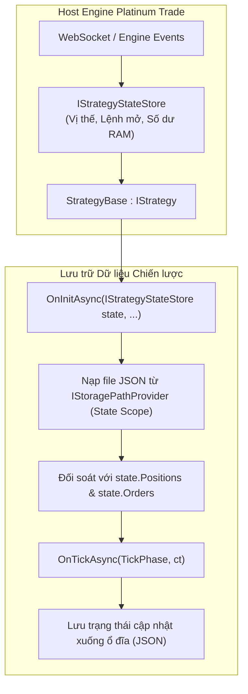

# Quản lý Trạng thái & Tự phục hồi sau Sự cố

Trong giao dịch thuật toán thực tế, chiến lược phải có khả năng theo dõi trạng thái thị trường, chống chịu sự cố khi tiến trình bị tắt, mất điện hoặc khởi động lại hệ thống.

Platinum Trade SDK phân tách việc quản lý trạng thái thành hai thành phần kiến trúc rõ rệt:
1. **Trạng thái Thời gian thực (`IStrategyStateStore`)**: Bộ chứa trạng thái trong bộ nhớ RAM do host engine quản lý, liên tục cập nhật danh sách lệnh mở, vị thế, số dư và nến gần nhất.
2. **Lưu trữ Bền vững trên Ổ đĩa (`IStoragePathProvider`)**: Cơ chế phân giải đường dẫn thư mục an toàn để lưu và nạp file JSON/dữ liệu tùy biến của chiến lược (như số tầng lưới, mức giá đỉnh high-water mark, thống kê rủi ro trong ngày).

---

## Kiến trúc Tổng quan



---

## 1. Truy xuất Trạng thái Runtime (`IStrategyStateStore`)

Khi chiến lược khởi chạy, host engine sẽ truyền một instance của `IStrategyStateStore` vào hàm `OnInitAsync()`. Bạn có thể lưu lại reference này để kiểm tra nhanh trạng thái giao dịch mà không cần gọi API mạng bất đồng bộ:

```csharp
public interface IStrategyStateStore
{
    IReadOnlyList<Order> Orders { get; }
    IReadOnlyList<AlgoOrder> AlgoOrders { get; }
    IReadOnlyList<Position> Positions { get; }
    IReadOnlyList<AccountBalance> Balances { get; }
    IReadOnlyList<Transaction> Transactions { get; }
    
    CandleData? LastKline { get; }
    bool HasOpenPosition { get; }
    bool HasOpenOrders { get; }
    bool HasProtectiveAlgoOrders { get; }
    int OpenOrderCount { get; }
    int AlgoOrderCount { get; }
}
```

### Ví dụ: Kiểm tra Vị thế & Lệnh Mở Nhanh
```csharp
public override async Task OnTickAsync(TickPhase tickPhase, CancellationToken ct)
{
    if (tickPhase != TickPhase.BarClose) return;

    // Kiểm tra trực tiếp trên bộ nhớ RAM
    if (_stateStore.HasOpenPosition)
    {
        var primaryPos = _stateStore.Positions.FirstOrDefault(p => p.Symbol == "BTC-USDT-SWAP");
        if (primaryPos != null)
        {
            Context.Logger.LogInformation("State", $"Khối lượng vị thế: {primaryPos.PositionQuantity}, PnL: {primaryPos.UnrealizedPnl}");
        }
        return;
    }

    if (!_stateStore.HasOpenOrders)
    {
        // An toàn để tìm kiếm tín hiệu mở vị thế mới
    }
}
```

---

## 2. Lưu trữ Dữ liệu Tùy biến với `IStoragePathProvider`

Đối với các biến trạng thái cần lưu giữ qua các lần tắt mở app (như số tầng lưới DCA, đỉnh giá cao nhất, giới hạn thua lỗ ngày), sử dụng `IStoragePathProvider` với phạm vi `StoragePathScope.State`:

```csharp
using System.Text.Json;
using Pt.Okx.Sdk.Enums;
using Pt.Okx.Sdk.Storage;
using Pt.Okx.Sdk.Storage.Enums;
using Pt.Okx.Sdk.Strategy;
using Pt.Okx.Sdk.Strategy.Events;

public class CustomBotState
{
    public DateTime LastSavedUtc { get; set; }
    public decimal HighWaterMarkPrice { get; set; }
    public int CompletedCycleCount { get; set; }
    public decimal CumulativeSessionPnl { get; set; }
}

public class ResilientStrategy : StrategyBase
{
    private IStrategyStateStore _stateStore = null!;
    private readonly IStoragePathProvider _storage;
    private CustomBotState _customState = new();
    private string _stateFilePath = string.Empty;

    // Inject qua DI container
    public ResilientStrategy(IStoragePathProvider storage)
    {
        _storage = storage;
    }

    public override async Task<bool> OnInitAsync(IStrategyStateStore state, CancellationToken cancellationToken)
    {
        _stateStore = state;

        // 1. Phân giải thư mục lưu state an toàn trên ổ đĩa
        string stateDir = _storage.GetPath(StoragePathScope.State);
        _stateFilePath = Path.Combine(stateDir, "my_strategy_state.json");

        // 2. Tải lại state cũ nếu file tồn tại
        if (File.Exists(_stateFilePath))
        {
            try
            {
                string json = await File.ReadAllTextAsync(_stateFilePath, cancellationToken);
                _customState = JsonSerializer.Deserialize<CustomBotState>(json) ?? new();
                Context.Logger.LogInformation("Recovery", $"Đã khôi phục state. Đỉnh giá cũ={_customState.HighWaterMarkPrice}");
            }
            catch (Exception ex)
            {
                Context.Logger.LogError(ex, "Lỗi đọc file state, khởi tạo phiên mới.");
                _customState = new CustomBotState();
            }
        }
        else
        {
            _customState = new CustomBotState
            {
                HighWaterMarkPrice = Context.Timeseries.CurrentTickPrice,
                LastSavedUtc = Context.Timeseries.GetCurrentTime()
            };
            await SaveCustomStateAsync(cancellationToken);
        }

        // 3. Đối soát với trạng thái thực tế từ host engine
        if (_stateStore.HasOpenPosition)
        {
            Context.Logger.LogInformation("Reconcile", $"Chiến lược tiếp tục quản lý {_stateStore.Positions.Count} vị thế đang mở.");
        }

        return true;
    }

    public override Task<bool> OnStopAsync(CancellationToken cancellationToken) => Task.FromResult(true);

    public override async Task OnTickAsync(TickPhase tickPhase, CancellationToken ct)
    {
        if (tickPhase != TickPhase.BarClose) return;

        decimal currentPrice = Context.Timeseries.CurrentTickPrice;
        if (currentPrice > _customState.HighWaterMarkPrice)
        {
            _customState.HighWaterMarkPrice = currentPrice;
            _customState.LastSavedUtc = Context.Timeseries.GetCurrentTime();
            await SaveCustomStateAsync(ct);
        }
    }

    private async Task SaveCustomStateAsync(CancellationToken ct)
    {
        // Bỏ qua ghi đĩa khi đang chạy Backtest để tối ưu tốc độ
        if (Context.Timeseries.EndTime.HasValue) return;

        string json = JsonSerializer.Serialize(_customState, new JsonSerializerOptions { WriteIndented = true });
        await File.WriteAllTextAsync(_stateFilePath, json, ct);
    }
}
```

---

## 3. Các Phạm vi Lưu trữ (Storage Scopes)

`IStoragePathProvider.GetPath(StoragePathScope scope)` cung cấp các thư mục riêng biệt:

| Phạm vi (Scope) | Phương thức / Đường dẫn | Mục đích sử dụng |
| :--- | :--- | :--- |
| `StoragePathScope.State` | `GetStateRoot()` | File lưu trạng thái JSON/binary của bot qua các lần restart. |
| `StoragePathScope.LiveLogs` | `GetLiveLogsRoot()` | File nhật ký giao dịch thực tế, trace phiên chạy. |
| `StoragePathScope.BacktestLogs` | `GetBacktestLogsRoot()` | File báo cáo CSV xuất từ phiên backtest. |
| `StoragePathScope.Cache` | `GetCacheRoot()` | Cache tính toán tạm thời hoặc dữ liệu tiền xử lý. |
| `StoragePathScope.Exports` | `GetExportsRoot()` | Các file báo cáo và biểu đồ người dùng xuất ra. |

---

## Tài liệu Liên quan

- [Kiến trúc Quản lý Trạng thái Plugin](../plugins/strategy/state-management.md) — Chi tiết kiến trúc State Manager.
- [Hướng dẫn Backtesting](./backtesting.md) — Thời gian tất định và tối ưu hiệu năng.
- [Tra cứu Storage API](../api-reference/storage/index.md) — Định nghĩa chi tiết `IStoragePathProvider`.
- [Tra cứu Trade API](../api-reference/client/trade.md) — Quản lý lệnh và vị thế.
