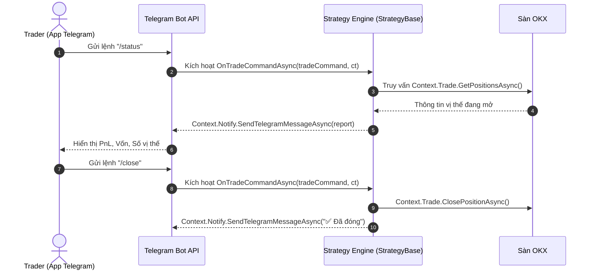

# Tích hợp Telegram Bot & Lệnh Tương tác 2 Chiều

Giám sát và điều khiển từ xa theo thời gian thực là tính năng tối quan trọng trong giao dịch thuật toán. Platinum Trade SDK tích hợp sâu với Telegram, cho phép chiến lược:

1. **Gửi cảnh báo (Broadcast Alerts)**: Thông báo tức thì khi khớp lệnh, chạm Stop Loss hoặc cảnh báo nguy cơ thanh lý.
2. **Điều khiển 2 chiều (Interactive Commands)**: Nhận lệnh tùy biến từ trader (như `/status`, `/pause`, `/close_all`, `/set_risk 2`) và phản hồi kết quả trực tiếp về Telegram.

---

## Luồng Tương tác (Interaction Flow)



---

## 1. Gửi Cảnh báo Giao dịch ra Telegram

Sử dụng `Context.Notify` để gửi thông báo:

```csharp
public override async Task OnTickAsync(TickPhase tickPhase, CancellationToken ct)
{
    if (tickPhase != TickPhase.BarClose) return;

    if (signalBuy)
    {
        var res = await Context.Trade.PlaceOrderAsync("BTC-USDT-SWAP", OrderSide.Buy, OrderType.Market, 1.0m, ct: ct);
        if (res.Success)
        {
            string message = 
                $"🚀 <b>Đã Đặt Lệnh MUA</b>\n" +
                $"• <b>Symbol:</b> <code>BTC-USDT-SWAP</code>\n" +
                $"• <b>Giá:</b> <code>{Context.Timeseries.CurrentTickPrice:F2}</code>\n" +
                $"• <b>Thời gian:</b> <code>{Context.Timeseries.GetCurrentTime():yyyy-MM-dd HH:mm:ss} UTC</code>";

            await Context.Notify.SendTelegramMessageAsync(message);
        }
    }
}
```

> [!TIP]
> Sử dụng các thẻ HTML chuẩn (`<b>`, `<i>`, `<code>`, `<pre>`) để tin nhắn hiển thị rõ ràng và đẹp mắt trên điện thoại.

---

## 2. Xử lý Lệnh Điều khiển 2 Chiều từ Telegram

Ghi đè hàm `OnTradeCommandAsync` trong lớp `StrategyBase` để xử lý các lệnh (`TradeCommand`) được gửi từ Telegram:

```csharp
using Pt.Okx.Sdk.Notifier.Enums;
using Pt.Okx.Sdk.Notifier.Models;
using Pt.Okx.Sdk.Strategy;
using Pt.Okx.Sdk.Strategy.Events;

public class TelegramInteractiveStrategy : StrategyBase
{
    private bool _isPaused = false;
    private decimal _riskPercentage = 1.0m;

    public override Task<bool> OnInitAsync(IStrategyStateStore state, CancellationToken cancellationToken) => Task.FromResult(true);
    public override Task<bool> OnStopAsync(CancellationToken cancellationToken) => Task.FromResult(true);

    public override async Task OnTickAsync(TickPhase tickPhase, CancellationToken ct)
    {
        if (_isPaused || tickPhase != TickPhase.BarClose) return;
        // Logic giao dịch thông thường ở đây
    }

    public override async Task OnTradeCommandAsync(TradeCommand tradeCommand, CancellationToken ct)
    {
        switch (tradeCommand.Action)
        {
            case TradeAction.Status:
                await HandleStatusAsync(ct);
                break;

            case TradeAction.PauseTrading:
                _isPaused = true;
                await Context.Notify.SendTelegramMessageAsync("⏸️ <b>Đã Tạm Dừng Bot</b>. Ngừng tìm kiếm lệnh mở mới.");
                break;

            case TradeAction.ResumeTrading:
                _isPaused = false;
                await Context.Notify.SendTelegramMessageAsync("▶️ <b>Tiếp Tục Chạy Bot</b>. Đang quét tín hiệu thị trường.");
                break;

            case TradeAction.Close:
                await HandleCloseAllAsync(ct);
                break;

            case TradeAction.Custom:
                await HandleCustomCommandAsync(tradeCommand, ct);
                break;

            default:
                await Context.Notify.SendTelegramMessageAsync($"ℹ️ Nhận hành động: <code>{tradeCommand.Action}</code>");
                break;
        }
    }

    private async Task HandleStatusAsync(CancellationToken ct)
    {
        var posRes = await Context.Trade.GetPositionsAsync(ct: ct);
        decimal equity = Context.Account.Equity;
        decimal wallet = Context.Account.WalletBalance;
        decimal pnl = Context.Account.UnrealizedPnL;

        string report = 
            $"📊 <b>Báo Cáo Trạng Thái Bot</b>\n" +
            $"───────────────────\n" +
            $"• <b>Trạng thái:</b> {(_isPaused ? "⏸️ Tạm dừng" : "🟢 Đang chạy")}\n" +
            $"• <b>Số dư ví:</b> <code>{wallet:F2} USDT</code>\n" +
            $"• <b>Vốn (Equity):</b> <code>{equity:F2} USDT</code>\n" +
            $"• <b>PnL Tạm tính:</b> <code>{(pnl >= 0 ? "+" : "")}{pnl:F2} USDT</code>\n" +
            $"• <b>Số vị thế mở:</b> <code>{posRes.Data?.Length ?? 0}</code>";

        await Context.Notify.SendTelegramMessageAsync(report);
    }

    private async Task HandleCloseAllAsync(CancellationToken ct)
    {
        var posRes = await Context.Trade.GetPositionsAsync(ct: ct);
        if (posRes.Success && posRes.Data.Length > 0)
        {
            foreach (var pos in posRes.Data)
            {
                await Context.Trade.ClosePositionAsync(pos.Symbol, pos.PositionSide, ct: ct);
            }
            await Context.Notify.SendTelegramMessageAsync("✅ <b>Lệnh Khẩn Cấp:</b> Đã đóng toàn bộ vị thế đang mở.");
        }
        else
        {
            await Context.Notify.SendTelegramMessageAsync("ℹ️ Hiện không có vị thế nào đang mở.");
        }
    }

    private async Task HandleCustomCommandAsync(TradeCommand cmd, CancellationToken ct)
    {
        if (cmd.CommandTag.Equals("setrisk", StringComparison.OrdinalIgnoreCase))
        {
            if (cmd.Params.TryGetValue("risk", out string? riskStr) && decimal.TryParse(riskStr, out decimal newRisk))
            {
                _riskPercentage = newRisk;
                await Context.Notify.SendTelegramMessageAsync($"✅ Đã cập nhật mức rủi ro mỗi lệnh: <code>{_riskPercentage}%</code>.");
            }
            else if (cmd.Amount > 0)
            {
                _riskPercentage = cmd.Amount;
                await Context.Notify.SendTelegramMessageAsync($"✅ Đã cập nhật mức rủi ro mỗi lệnh: <code>{_riskPercentage}%</code>.");
            }
        }
    }
}
```

---

## 3. Phân tích Tham số Lệnh (Command Arguments)

Lệnh có thể kèm tham số (ví dụ: `/set_risk 2.5` hoặc `/order buy 0.5`):

```csharp
case "/set_risk":
    if (args.Length > 0 && decimal.TryParse(args[0], out decimal newRisk))
    {
        _riskPercentage = newRisk;
        await e.ReplyAsync($"✅ Đã cập nhật mức rủi ro mỗi lệnh: <code>{_riskPercentage}%</code>.");
    }
    else
    {
        await e.ReplyAsync("⚠️ Cú pháp: <code>/set_risk &lt;phần_trăm&gt;</code> (Ví dụ: <code>/set_risk 2.5</code>)");
    }
    break;
```

---

## Tài liệu Liên quan

- [Kiến trúc Lệnh Telegram Plugin](../plugins/strategy/telegram-commands.md) — Tổng quan kiến trúc Telegram command extensions.
- [Tra cứu Notification API](../api-reference/notifications/index.md) — Các phương thức và cấu hình của `Context.Notify`.
- [Quản lý Trạng thái & Lưu trữ](./state-persistence.md) — Lưu cấu hình lệnh qua các lần restart.
- [Tra cứu Trade API](../api-reference/client/trade.md) — Thực thi lệnh giao dịch từ xa.
